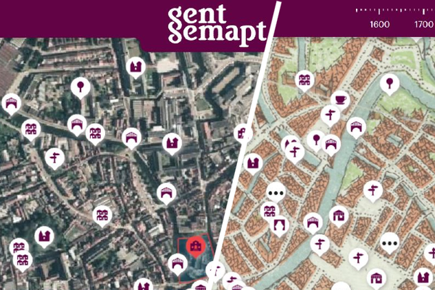

To test links to other markdown files this is a test file with a link to [readme](README.md).

# The Ghent Center for Digital Humanities - a Ghent University Core Facility

The Ghent Centre for Digital Humanities offers a number of services to advise and guide digitally-enabled research in the arts and humanities at Ghent University and beyond. The main beneficiaries of our services are researchers from Ghent University, researchers from other knowledge institutes or partners situated in the GLAM (Galleries, Libraries, Archives and Museums) sector. We offer support throughout whole project lifecycles including funding applications, project management, measuring impact, and infrastructure sustainability. We have successfully supported funding applications within Ghent University, in Flanders (FWO), at Belgian federal level (Belspo) and in Europe (H2020).

The main focus points of the services that we offer are:
.
* **Collaborative databases:**  advice and support for collaborative databases. We help researchers to develop database instances, powered by e.g. Nodegoat. We provides advice regarding data modelling, data standards and linked open data.
* **Digital text analysis:**  we aim to improve digital text analysis by offering support and information to researchers. You can contact us for advice on text encoding standards and digital editions, working with digital text analysis tools and AI assisted HTR - Handwritten Text Recognition.
* **Geospatial analysis:**  we offer advice, support and training regarding geospatial data management, analysis and visualisation.
* **Digital heritage:** we offer support in regards to digital heritage, participation and virtual expositions. We help researchers, heritage institutions, teachers and students to create, manage and enrich their own digital collections and set up virtual exhibitions.

An example of a recent project developed and coordinated by GhentCDH is 'Ghent mapped' which alliterates better in Dutch: __'Gent Gemapt'__. The project provides a digital map of Ghent which stacks 20 historical maps and connects 4,000 places to 10,000 pieces of heritage which have been reunited virtually. Go explore Ghent layer by layer, from the Middle Ages to today via gentgemapt.be. Gent Gemapt uses open source technology Omeka S, Madoc, IIIF (International Image Interoperability Framework) and Linked Open Data. It is a collaboration of Ghent University Library, STAM - Stadsmuseum Gent, Huis van Alijn, Industriemuseum, Archief Gent, Amsab-Institute for Social History, Liberas and Erfgoedcel Gent.

 If you are interested in the expertise we offer please do contact us and perhaps we can collaborate on your 
 next project.

* [Ghent Center for Digital Humanities](https://www.ghentcdh.ugent.be/)
* [Gent gemapt](https://gentgemapt.be) an example of a GhentCDH project.
* [More GhentCDH projects](https://www.ghentcdh.ugent.be/projects)

 
Have a look at [Gent gemapt](https://gentgemapt.be)

